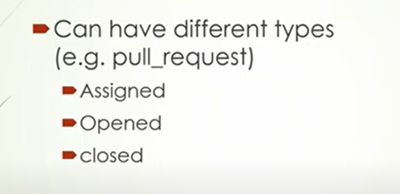

# actions-test-yml

How to run the project

    npx playwright test --project=chromium

components of GitHub actions
1. Events: They trigger the actions.

    -> more than 35 events and continuously being added.
    
    -> workflow_dispatch, sheduled, pull_request, repository_dispatch (REST_API), issues 

    -> defined by "on"

    -> each event can have several types

   -> each event can have different branches

2. Jobs: are a set of steps that run in sequence to accomplish a task.
   
    -> Each job runs on its own runner.

3. Steps: Are either a shell script, or an actions that will be run on the runner.

4. Actions: They are individual tasks that we can combine to empower our jobs.
    
    -> available from community - GitHub Marketplace

    -> GitHub (prefix "actions/")

    -> own actions 

5. Runners 

    -> machines where workflow gets executed

===========================
workflow
=============================

